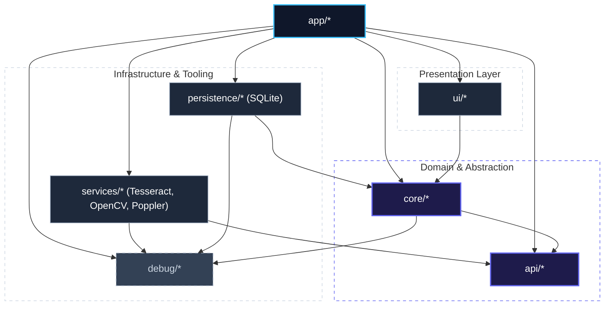
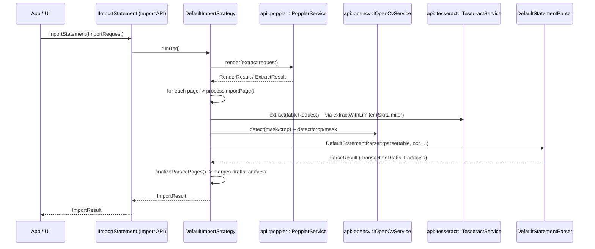
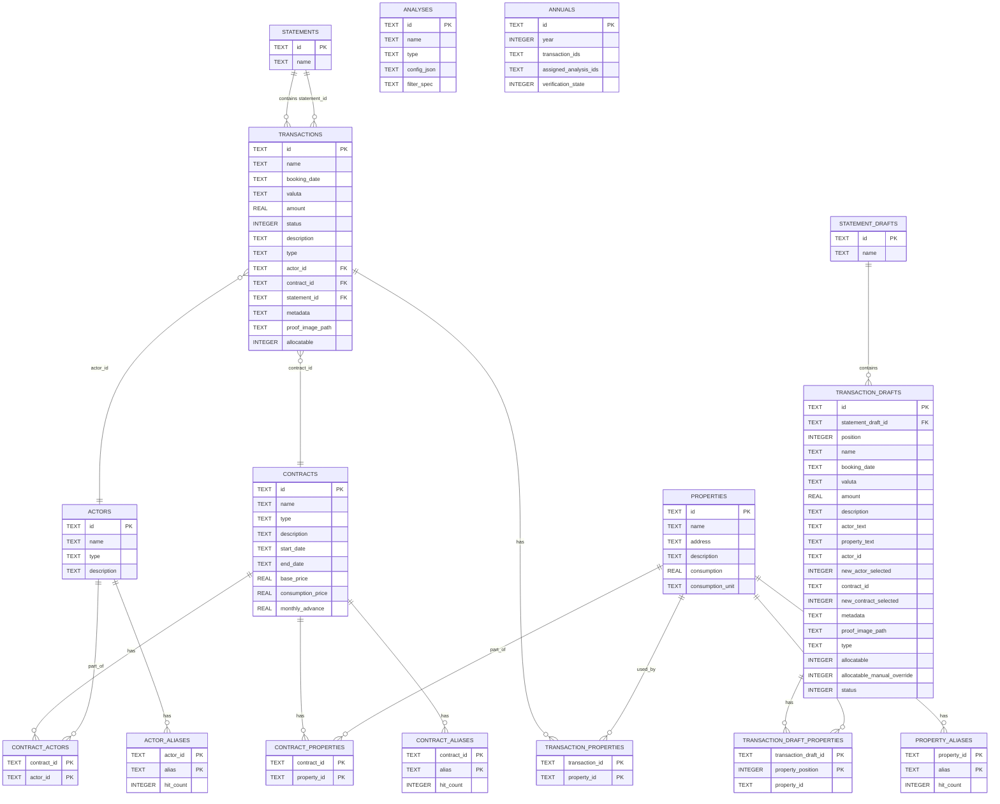

# Design — FOSSredder

Date: 2026-04-21

Author: Wilhelm Altemeier

Status: Draft

## Table of Contents
1. [Executive Summary](#1-executive-summary)
2. [System Context](#2-system-context)
3. [Architecture Design](#3-architecture-design)
4. [Component Specifications](#4-component-specifications)
5. [Infrastructure Layer](#5-infrastructure-layer)
6. [UI Layer & Presentation](#6-ui-layer--presentation)
7. [Quality Assurance & Testing](#7-quality-assurance--testing)
8. [Deployment & Environment](#8-deployment--environment)
9. [Security & Privacy](#9-security--privacy)
10. [Appendix](#10-appendix)

---

## 1. Executive Summary <a id="1-executive-summary"></a>

FOSSredder is a local-first system for extracting, managing, and analyzing financial data from bank statements in PDF or image formats. The system transforms raw documents into a structured SQLite database to facilitate long-term financial reporting and annual accounting without cloud-based processing. The implementation covers the entire lifecycle from document rendering and computer vision-based table detection to the generation of persistent analysis snapshots and annual reports.

The technical architecture consists of a modular C++ engine that separates domain logic from the graphical user interface and third-party libraries. The ingestion pipeline follows a fixed sequence using Poppler for document rendering, OpenCV for table structure detection, and Tesseract OCR for text recovery. This process combines spatial coordinates with extracted text to identify transaction rows and columns. After parsing the metadata into domain objects, a matching layer uses fuzzy logic to link transactions to actors, properties, and contracts for automated cost allocation.

Beyond data ingestion, the system provides a framework for creating immutable analysis objects and annual reports. These objects capture snapshots of financial data to ensure consistency, even if underlying records are modified. Users can extend these snapshots with additional data, such as tax-related vectors, and export the consolidated results into XLSX or CSV formats. The design ensures that the entire process from initial PDF rendering to final report generation is testable, private, and capable of producing results that can be verified against manual accounting records.

## 2. System Context <a id="2-system-context"></a>
### 2.1 Operational Environment

FOSSredder is a standalone desktop application for local financial data processing. The system follows a zero-network-access policy to ensure data privacy. High-resolution document ingestion and OCR tasks are handled asynchronously to maintain UI responsiveness during peak computational loads.

### 2.2 Technical Constraints

#### Development Stack
* **Language:** C++20
* **Build System:** CMake
* **Package Management:** vcpkg (utilized in manifest mode with a project-specific toolchain)
* **UI Framework:** Qt 6 / QML

#### Core Toolchain
* **PDF Rendering:** Poppler
* **Image Processing:** OpenCV
* **OCR Engine:** Tesseract

#### Runtime & Platform
* **Target OS:** Windows 10 or newer
* **Architecture:** x86_64
* **Persistence:** SQLite (Single-file database)
* **Concurrency:** Heavy workloads are managed via the central `Scheduler` and `SlotLimiter`.

### 2.3 System Boundaries

The system operates exclusively on the local machine. Inbound data is restricted to user-provided PDF and image files. Outbound data is limited to structured exports (XLSX, CSV) and the internal SQLite state. The architecture strictly excludes telemetry, cloud synchronization, and external API dependencies.

## 3. Architecture Design <a id="3-architecture-design"></a>
### 3.1 Layered Architecture

The system is divided into four main layers:

1. **Presentation Layer (ui, app)**: Handles QML views and C++ controllers for user interaction; the app component serves as the central composition root for bootstrapping and wiring concrete implementations.
2. **Domain Layer (core)**: Houses the central business logic, orchestrators, and use cases for document processing; defines the repository interfaces that decouple data access from the rest of the system.
3. **Abstraction Layer (api)**: Defines the interfaces for all processing services such as OCR, image enhancement, PDF rendering; ensures loose coupling from external libraries like Tesseract, OpenCV, or Poppler.
4. **Infrastructure Layer (services, persistence, debug)**: Contains the concrete technical implementations, including engines for document analysis, SQLite database persistence, and system-wide diagnostic or logging tools.
 


### 3.2 Design Principles

The architecture follows two core mandates to ensure long-term maintainability and system stability:

* **Dependency Inversion**: The `core` layer operates exclusively against abstractions. All external capabilities (Persistence, OCR, PDF Rendering) are consumed via interfaces defined in `core` or `api`. Concrete implementations are injected at runtime by the `app` component, enabling isolated unit testing of the domain logic without infrastructure dependencies.
* **Decoupled Execution**: Computationally intensive operations are encapsulated as discrete `Job` objects. These are managed by a centralized `JobSystem` that enforces resource constraints and ensures UI responsiveness by decoupling long-running processing tasks from the main event loop.

## 4. Component Specifications <a id="4-component-specifications"></a>
### 4.1 Domain Entities

Below is a UML class diagram summarizing the main domain entities, their attributes, and relationships:

```mermaid
classDiagram
    direction TB

    class Statement {
        <<Entity>>
        +string id
        +string name
    }

    class Transaction {
        <<Entity>>
        +string id
        +string name
        +string bookingDate
        +string valuta
        +double amount = 0.0
        +Transaction::Status status
        +string contractId
        +string actorId
        +string statementId
        +string description
        +bool allocatable
        +vector~string~ propertyIds
    }

    class Actor {
        <<Entity>>
        +string id
        +string name
        +string type
        +string description
        +vector~string~ aliases
        +vector~AliasUsage~ aliasUsage
    }

    class AliasUsage {
        <<ValueObject>>
        +string alias
        +int hitCount = 0
        +string lastUsedAt
        +string updatedAt
        +string createdAt
    }

    class Property {
        <<Entity>>
        +string id
        +string name
        +string address
        +string description
        +double consumption = 0.0
        +string consumptionUnit
        +vector~string~ aliases
        +vector~AliasUsage~ aliasUsage
    }

    class Contract {
        <<Entity>>
        +string id
        +string name
        +string type
        +string description
        +string startDate
        +string endDate
        +double basePrice = 0.0
        +double consumptionPrice = 0.0
        +double monthlyAdvance = 0.0
        +vector~string~ actorIds
        +vector~string~ propertyIds
        +vector~string~ aliases
        +vector~AliasUsage~ aliasUsage
    }

    class Analysis {
        <<Entity>>
        +string id
        +string name
        +string type
        +string configJson
        +string filterSpec
        +unordered_map~string,double~ adjustments
        +string createdAt
        +string updatedAt
        +int schemaVersion
    }

    class Annual {
        <<Entity>>
        +string id
        +int year
        +vector~string~ transactionIds
        +vector~string~ assignedAnalysisIds
        +VerificationState verificationState
        +string createdAt
        +string updatedAt
        +int schemaVersion
    }

    class StatementDraft {
        <<Draft>>
        +string id
        +string name
        +vector~TransactionDraft~ transactions
    }

    class TransactionDraft {
        <<Draft>>
        +string id
        +string statementDraftId
        +int position
        +string name
        +string bookingDate
        +string valuta
        +double amount
        +string description
        +string actorText
        +string propertyText
        +string actorId
        +bool newActorSelected
        +string contractId
        +bool newContractSelected
        +string metadata
        +string proofImagePath
        +string type
        +bool allocatable
        +bool allocatableManualOverride
        +Transaction::Status status
        +vector~string~ propertyIds
    }

    class ImportLog {
        <<Log>>
        +string id
        +string time
        +string type
        +string file
        +string status
        +string message
        +bool draftAttached = false
        +string draftId
        +string statementId
    }

    class ExportLog {
        <<Log>>
        +TODO : details pending
    }

    %% Beziehungen
    Statement "1" *-- "many" Transaction : contains
    StatementDraft "1" *-- "*" TransactionDraft : transactions

    Actor "1" *-- "many" AliasUsage : aliasUsage
    Property "1" *-- "many" AliasUsage : aliasUsage
    Contract "1" *-- "many" AliasUsage : aliasUsage

    Contract "1" o-- "*" Actor : actorIds
    Contract "1" o-- "*" Property : propertyIds

    Transaction --> Contract : contractId
    Transaction --> Actor : actorId
    Transaction --> Statement : statementId

    Annual "1" o-- "*" Transaction : transactionIds
    Annual "1" o-- "*" Analysis : assignedAnalysisIds
 ```

### 4.2 Domain Interfaces & Storage
#### 4.2.1 Repository Interfaces

The core exposes a set of repository interfaces. Each interface manages the lifecycle of a
single domain entity (create / read / update / delete) and any small domain-specific helper
queries that are required by higher-level code. Concrete implementations (adapters) live in the
`persistence` layer and implement these interfaces.

Below is a compact summary of the repository interfaces and the key methods implementers must
provide:

| Interface | Responsibility | Key methods (condensed) |
|---|---:|---|
| `IActorRepository` | CRUD for `core::domain::Actor` | `addActor(...)`, `getActors()`, `getActorById(id)`, `removeActor(id)`, `updateActor(...)`, `upsertActor(...)`, `clearActors()` |
| `IPropertyRepository` | CRUD for `core::domain::Property` | `addProperty(...)`, `getProperties()`, `getPropertyById(id)`, `removeProperty(id)`, `updateProperty(...)`, `upsertProperty(...)`, `clearProperties()` |
| `IContractRepository` | CRUD + helper queries for `core::domain::Contract` | `addContract(...)`, `getContracts()`, `getContractById(id)`, `removeContract(id)`, `updateContract(...)`, `upsertContract(...)`, `clearContracts()`, `getContractsForActor(actorId)`, `getContractsForProperty(propertyId)`, `getActorIdsForContract(contractId)`, `getPropertyIdsForContract(contractId)` |
| `IStatementRepository` | CRUD for `core::domain::Statement` | `addStatement(...)`, `getStatements()`, `getStatementById(id)`, `removeStatement(id)`, `updateStatement(...)`, `upsertStatement(...)`, `clearStatements()` |
| `ITransactionRepository` | CRUD + domain operations for `core::domain::Transaction` | `addTransaction(...)`, `getTransactions()`, `getTransactionById(id)`, `removeTransaction(id)`, `updateTransaction(...)`, `upsertTransaction(...)`, `clearTransactions()`, `getTransactionsForContract(contractId)`, `assignTransactionsToContract(contractId, ids)` |
| `IStatementDraftRepository` | CRUD for `core::domain::StatementDraft` entities (Ingestion) | `addStatementDraft(...)`, `getStatementDrafts()`, `getStatementDraftById(id)`, `removeStatementDraft(id)`, `updateStatementDraft(...)`, `upsertStatementDraft(...)`, `clearStatementDrafts()` (plus convenience helpers) |
| `ITransactionDraftRepository` | CRUD for `core::domain::TransactionDraft` entities (Ingestion) | `addTransactionDraft(...)`, `getTransactionDrafts()`, `getTransactionDraftById(id)`, `removeTransactionDraft(id)`, `updateTransactionDraft(...)`, `upsertTransactionDraft(...)`, `clearTransactionDrafts()` (plus helper `saveTransactionDrafts(...)`) |
| `IAnalysisRepository` | CRUD for `core::domain::Analysis` | `addAnalysis(...)`, `getAnalyses()`, `getAnalysisById(id)`, `removeAnalysis(id)`, `updateAnalysis(...)`, `upsertAnalysis(...)`, `clearAnalyses()` |
| `IAnnualRepository` | CRUD for `core::domain::Annual` | `addAnnual(...)`, `getAnnuals()`, `getAnnualById(id)`, `removeAnnual(id)`, `updateAnnual(...)`, `upsertAnnual(...)`, `clearAnnuals()` |

#### 4.2.2 Storage Infrastructure & Orchestration

**Key Definitions & Contracts:**
```cpp
using Repositories = RepositoryBundle;
using RepoFactory = std::function<Repositories(const std::string& dbPath)>;
using AtomicStoreSave = std::function<core::domain::DeletionImpact(const std::string& path, const core::domain::AppState& state)>;
using AtomicStoreLoad = std::function<core::domain::AppState(const std::string& path)>;
using DeletionImpactCallback = std::function<void(const core::domain::DeletionImpact&)>;
```

* **`IStorageManager`**: Acts as the central orchestrator for persistence strategies. It manages file-level operations (`loadFrom`, `saveAs`, `createNew`) and bridges physical storage with core logic. It utilizes the `DeletionImpact` mechanism to notify the UI when store-level changes require synchronization of in-memory models.
* **`IRegistry`**: A lightweight abstraction used to persist and retrieve application environment settings, such as the most recently accessed project path.
* **`RepositoryBundle`**: A composite structure that aggregates all repository interfaces defined in **Section 4.2.1**. It serves as a unified injection point for core services, ensuring consistent access to the entire persistence layer.

### 4.3 Core Logic & Processing
#### 4.3.1 Ingestion & parsing

The import pipeline implemented in `core/src/import` is an asynchronous, page‑oriented workflow that turns a file into `ImportResult` which contains parsed `TransactionDraft`s, artifacts and diagnostic traces. The actual entry point for callers is the `IImportStatement` abstraction (factory in `ImportStatement.cpp`), whose default strategy coordinates the steps described below.

Key infrastructure abstractions invoked by the pipeline (see `core/src/import` and `core/src/import/parsing`):
- `api::poppler::IPopplerService` — page rendering and text extraction (render / extract results).
- `api::opencv::IOpenCvService` — mask, detect, crop and table layout helpers (`detect`, `crop`, `mask`).
- `api::tesseract::ITesseractService` — OCR extraction (`extract`) returning `api::tesseract::ExtractResult`.
- Parsing helpers: `DefaultStatementParser::parse` and related helpers under `core/src/import/parsing`.

Sequence:



Notes:
- The implementation uses `processImportPage` (see `ImportPipelineHelpers.cpp`) which performs `mask`, `detect`, `crop`, and then calls Tesseract via `extractWithLimiter` (connected to a `core::jobs::SlotLimiter`) so OCR concurrency is bounded.
- Page‑level OCR TSV and parser logs are stored as artifacts in the resulting `ImportResult` (see `storeTsvArtifact`).
- Parsing of OCR+layout into drafts is performed by `DefaultStatementParser::parse`, which returns `ParseResult` containing `TransactionDraft`s, debug lines and per‑page artifacts.

#### 4.3.2 Post‑parse processing & matching

After parsing the pipeline performs deterministic post‑processing in `finalizeParsedPages` and later stages of the import strategy:
- Merge page drafts into a statement draft and normalize booking dates / transaction indices.
- Apply alias matching and assignment helpers (catalog / facade) to propose `actorId`, `propertyIds` and `contractId` for each `TransactionDraft`.
- Persist interim drafts via `IStatementDraftRepository` / `ITransactionDraftRepository` when the user chooses to keep a draft or when import finalization requires it.

Contracts and invariants:
- Parsers and post‑processors must not throw fatal exceptions; they produce partial results plus diagnostics.
- Matching operations must be idempotent and produce deterministic suggestions. Updates to `AliasUsage` (hit counts, timestamps) are side effects of matching and must be recorded by the catalog layer.

### 4.4 Application & State Management
#### 4.4.1 AppState ownership (WorkspaceSession)

- The `WorkspaceSession` (see `core/include/core/application/WorkspaceSession.h` / `core/src/application/WorkspaceSession.cpp`) owns the mutable `core::domain::AppState` instance (`state_`) and a unique `IStorageManager` implementation (`storageManager_`).
- `WorkspaceSession` exposes `state()` and `mutableState()` accessors and a `StateChanged` callback (`setStateChangedCallback`) that callers (e.g. the UI) can register to receive notifications after state changes.
- On construction the `WorkspaceSession` wires the `IStorageManager` deletion impact callback and forwards storage-produced `DeletionImpact` values to any registered session callback.

#### 4.4.2 Persistence flows (WorkspaceSession + AppStateManager)

- Loading and saving are performed by `WorkspaceSession` via the configured `IStorageManager`:
  - `openLatest()` queries `storageManager_->loadLatestPath()` and then `loadFrom(path)` to obtain an `AppState`.
  - `openFile(path)` calls `storageManager_->loadFrom(path)` and replaces the in‑memory state.
  - `newFile(path)` delegates to `storageManager_->createNew(path)` then resets `state_` to an empty `AppState`.
  - `saveFile()` and `commit()` call `storageManager_->save(state_)` (save to current path); `saveFileAs(path)` calls `storageManager_->saveAs(path, state_)`.
- Under the hood, `IStorageManager` either uses repository-backed persistence (via a `RepoFactory` that provides a `RepositoryBundle`) or an atomic save/load callback. The repository-backed load/save is implemented by `AppStateManager` which maps between `RepositoryBundle` and `core::domain::AppState` (`core/include/core/application/AppStateManager.h`).

#### 4.4.3 Mutation API and coordination (AppStateFacade)

- The `AppStateFacade` (see `core/include/core/application/AppStateFacade.h` and `core/src/application/AppStateFacade.cpp`) is the application‑facing API used by UI controllers. It composes a `WorkspaceSession` and a `CatalogService` to provide high‑level mutation operations such as `addActor`, `updateContract`, `addTransaction`, `finalizeStatementDraft`, etc.
- Typical mutation flow:
  1. A facade method (e.g. `addActor(...)`) calls into the `CatalogService` to perform the change on `mutableState()` and returns the created id.
  2. The facade calls `commit()` (or the session arranges persistence) which results in `WorkspaceSession` invoking `storageManager_->save(state_)` when a current path exists.
  3. After persistence, `WorkspaceSession::notifyState()` invokes the registered `StateChanged` callback to update UI models.
- The facade also exposes configuration hooks for persistence and error reporting: `setRepoFactory`, `setAtomicStoreSave`, `setAtomicStoreLoad`, `setDeletionImpactCallback`, and `setErrorReporter` which are forwarded to the session/storage manager.

#### 4.4.4 UI synchronization, deletion handling and observability

- `WorkspaceSession` records a `DeletionImpactCallback` received from `IStorageManager` and forwards it to a registered session callback. The UI layer (e.g. `ui::SessionStore`) consumes deletion impacts to remove stale rows and keep in-memory view models consistent (see `ui/src/state/SessionMutationState.cpp`).
- Error reporting is centralized via `IErrorReporter` — sessions and import strategies use the reporter to surface exceptions and warnings instead of throwing fatal errors.
- State change notifications are intentionally coarse‑grained (the entire `AppState` is passed to `StateChanged`) to keep synchronization simple. UI adapters maintain lightweight models that mirror `AppState` contents and provide incremental updates where necessary.

## 5. Infrastructure Layer <a id="5-infrastructure-layer"></a>
### 5.1 Persistence & Storage

This project provides a SQLite‑backed persistence implementation and an optional atomic store wrapper. Key components and responsibilities:

- `persistence::Factory` (`persistence/src/Factory.cpp`) — constructs repository bundles and low‑level `SqliteDb` instances used by repository adapters.
- `persistence::SqliteDb` (`persistence/src/SqliteDb.cpp`, `persistence/include/persistence/SqliteDb.h`) — thin wrapper around `sqlite3` handles and connection lifecycle.
- `persistence::AppStateStore` (`persistence/src/AppStateStore.cpp`, `persistence/include/persistence/AppStateStore.h`) — implements the atomic store save/load used by the application startup path (AppStateStore saves the complete `AppState` in a single operation and returns a `DeletionImpact`).
- Repository implementations (`persistence/src/repositories/*.cpp`, headers in `persistence/include/persistence/repositories`) — concrete `Sqlite*Repository` classes that implement the `I*Repository` interfaces declared in `core/include/core/repositories` (actors, properties, contracts, statements, transactions, drafts, analyses, annuals).
- `persistence::SqliteRegistry` (`persistence/src/SqliteRegistry.cpp`) — small registry used to persist the latest workspace path.
- `persistence::SqliteSchema` (`persistence/src/SqliteSchema.cpp`) — schema creation and migration helpers.

Operational note: `app/src/main.cpp` configures both a `RepoFactory` (repository flow) and `AppStateStore` (atomic flow) and the runtime currently prefers the atomic callbacks when they are present. See `core/src/storage/StorageManager.cpp` for the selection logic.

ER diagram (final schema / baseline assumed — displays the post‑migration table names)



### 5.2 External tool adapters (Poppler / OpenCV / Tesseract)

The ingestion pipeline interacts with external libraries through small adapter/service interfaces under `api/include`:

- `api::poppler::IPopplerService` (`api/include/api/poppler/IPopplerService.h`) — page rendering and text extraction.
- `api::opencv::IOpenCvService` (`api/include/api/opencv/IOpenCvService.h`) — image masks, table detection and crop operations (`mask`, `detect`, `crop`, `table` models).
- `api::tesseract::ITesseractService` (`api/include/api/tesseract/ITesseractService.h`) — OCR extraction returning `ExtractResult` / TSV output.

These interfaces are implemented by concrete adapters in the `services` / `infrastructure` layer of the project (see `app` startup wiring in `app/src/main.cpp`). The import strategy uses `extractWithLimiter` (in `ImportPipelineHelpers.cpp`) to bound OCR concurrency via `core::jobs::SlotLimiter`.

### 5.3 Job system and concurrency

Long‑running tasks (imports) are scheduled via the job subsystem in `core/src/jobs` and its headers in `core/include/core/jobs`:

- `core::jobs::JobSystem` / `Scheduler` (`core/src/jobs/JobSystem.cpp`, `core/src/jobs/Scheduler.cpp`, headers in `core/include/core/jobs`) — central scheduling primitives for background jobs.
- `core::jobs::JobManager` (`core/src/jobs/JobManager.cpp`) — process and lifecycle helper used by higher‑level services.
- `core::jobs::SlotLimiter` (used from import code) — limits parallel OCR work so Tesseract calls are bounded.

Import strategies call OCR through `extractWithLimiter` which acquires/releases slots on the limiter to avoid saturating CPU / OCR resources (see `core/src/import/ImportPipelineHelpers.cpp`).

### 5.4 Diagnostics & artifacts

Import pipelines produce artifacts and diagnostics that are persisted in the `ImportResult` and can be used by the UI for debugging and export:

- TSV artifacts and parser logs are created per page by the import flow (`storeTsvArtifact` in `ImportPipelineHelpers.cpp`) and attached to the `ImportResult`.
- Repository diagnostics helpers exist in `persistence/src/RepositoryDiagnostics.h` to log repository operations and errors.

## 6. UI Layer & Presentation <a id="6-ui-layer--presentation"></a>

This section maps the presentation concerns to concrete files and runtime interactions in the codebase, bridging the Qt/QML frontend with the C++ UI logic.

### 6.1 Pattern and code locations

The UI follows an MVVM-like composition where QML views are backed by C++ controllers and view models. Relevant locations in the workspace:

- Views (QML): `ui/qml/*` — QML modules used by the application UI.
- Controllers (C++): `ui/src/controllers/*` — examples: `ActorController.cpp`, `DraftController.cpp`, `ImportController.cpp`, `StorageController.cpp`.
- View models / session state: `ui/src/state/*` — `SessionStore.cpp`, `SessionMutationState.cpp`, and additional import run models under `ui/src/import`.

### 6.2 Session wiring and synchronization

Practical wiring in the codebase:

- The UI obtains an `AppStateFacade` instance during application composition and uses controllers to call into the facade.
- The UI registers a `StateChanged` callback on the session/facade. `WorkspaceSession::notifyState()` (see `core/src/application/WorkspaceSession.cpp`) triggers the UI to refresh or incrementally update view models.
- `DeletionImpact` handling: `WorkspaceSession` forwards storage deletion impacts to the UI; `SessionMutationState::applyDeletionImpact` (see `ui/src/state/SessionMutationState.cpp`) removes stale rows from models.

### 6.3 Technical Data Flow

The diagram below uses actual components and file groups used in the codebase. Labels avoid parentheses/special characters to keep Mermaid parsing robust.

```mermaid
graph LR
    QML["QML View (ui/qml)"]
    Controller["UI Controller (ui/src/controllers)"]
    ViewModels["SessionStore / ViewModels (ui/src/state)"]
    Facade["AppStateFacade (core/include/core/application)"]
    Session["WorkspaceSession (core/src/application)"]
    Storage["IStorageManager / StorageManager (core/src/storage)"]
    RepoFactory["RepoFactory -> RepositoryBundle (persistence/Factory)"]
    AppStateManager["AppStateManager (core/include/core/application)"]
    Persistence["SqliteDb / AppStateStore (persistence)"]
    ImportRun["ImportRunStore / ImportJobBridge (ui/src/import)"]
    JobSystem["JobSystem / SlotLimiter (core/src/jobs)"]

    QML -->|user action| Controller
    Controller -->|calls facade| Facade
    Facade -->|mutate / commit| Session
    Session -->|save / load| Storage
    Storage -->|repo flow| RepoFactory
    RepoFactory -->|provides repositories| AppStateManager
    AppStateManager -->|CRUD| Persistence

    Session -->|state changed callback| ViewModels
    ViewModels -->|Q_PROPERTY / signals| QML

    QML -->|start import| ImportRun
    ImportRun -->|schedule OCR| JobSystem
    JobSystem -->|executes| ImportRun
    ImportRun -->|produces ImportResult| Session

    classDef infra fill:#f8fafc,stroke:#94a3b8
    class Storage,RepoFactory,AppStateManager,Persistence,JobSystem infra
```



### 6.4 Key UI workflows

- **Ingestion Wizard / Import**: implemented across `ui/src/import/*` (e.g. `ImportRunStore.cpp`, `ImportState.cpp`, `ImportJobBridge.cpp`). The UI triggers `IImportStatement` (core import strategy) and observes progress through job signals and `ImportRunStore`.
- **Draft Review**: `ui/src/controllers/DraftController.cpp` together with `ui/src/import/DraftViewMapper.cpp` and `ui/src/import/ImportDraftMapper.cpp` expose `TransactionDraft` fields and proof images from `ImportResult` for QML review.
- **Job Observability**: `core/src/jobs/*` provides progress and cancellation primitives consumed by UI components under `ui/src/state` and `ui/src/import` to render progress bars and status.

## 7. Quality Assurance & Testing <a id="7-quality-assurance--testing"></a>

This project includes unit, integration and UI tests. The test layout and tools are aligned with the C++/Qt code structure so implementers can find and run tests close to the code under test.

### 7.1 Test layout
- Core unit tests (Google Test): `core/tests/unit/*` (examples: `TestDefaultStatementParser.cpp`, `TestAppStateManager.cpp`, `TestAppStateFacade.cpp`).
- Core interaction/integration tests: `core/tests/interaction/*` (examples: `TestStorageManagerInteraction.cpp`, `TestAppStateManagerInteraction.cpp`).
- Persistence tests: `persistence/tests/unit/*` (examples: `TestAppStateStore.cpp`, `TestSqliteRegistry.cpp`).
- UI tests (QML / Qt Test): `ui/tests/qml/*` (examples: `tst_ExportView.qml`).
- Test helpers / mocks: `core/tests/include/mocks/*` (e.g. `MockStorageManager.h`, `MockActorRepository.h`) used to isolate units from disk/IO.

### 7.2 How tests are wired and run
- Tests are registered as CMake test targets in the respective `CMakeLists.txt` for `core`, `persistence`, and `ui`. The build generates native test executables that are runnable via CTest or Visual Studio Test Explorer.
- Typical local run (CLI):
  - Configure: `cmake -S . -B build -G "Visual Studio 18 2026"`
  - Build: `cmake --build build --config Debug`
  - Run all tests: `ctest -C Debug --output-on-failure` (from `build`).
  - Run a single test: `ctest -R <TestName> -C Debug --output-on-failure`.
- QML tests are executed by the Qt test harness; they appear as CTest targets and can be run with the same `ctest` commands or through the Test Explorer in Visual Studio.

### 7.3 Test guidance and conventions
- Use mocks from `core/tests/include/mocks` to avoid hitting the real database for unit tests. Prefer in-memory or temp-file SQLite only in integration tests.
- Keep parser tests deterministic by using stored OCR TSV fixtures (see existing parser tests in `core/tests/unit`).
- Interaction/integration tests that exercise persistence should create isolated temporary DB paths and remove them after the test to avoid cross-test interference.

### 7.4 CI recommendations (brief)
- CI should build the solution and run `ctest` in Debug (or CI configuration) and fail the build on test failures. Capture and attach failing test logs for debugging.

### 7.5 Adding tests
- Add new tests under the appropriate `*/tests/*` folder and update the subproject `CMakeLists.txt` following the existing examples. Add mocks in `core/tests/include/mocks` when needed.

## 8. Deployment & Environment <a id="8-deployment--environment"></a>
### 8.1 Target Platform
The application is designed for desktop environments with a primary focus on performance and local resource management:
* **Operating System**: Windows 10/11 (x86_64).
* **Hardware Requirements**: Requires a multi-core CPU to effectively utilize the asynchronous Job System for OCR tasks. Minimum recommended RAM is 8GB to handle high-resolution PDF rendering and image processing buffers.

### 8.2 Execution Environment
FOSSredder operates as a portable-friendly desktop application. It does not require a centralized server or background daemon:
* **Binary Distribution**: The application is deployed as a standalone executable with linked dynamic libraries (DLLs) for Qt, OpenCV, and Tesseract.
* **Working Directory**: The application maintains its configuration and a small registry for the most recent workspace paths in the standard local application data folder.

### 8.3 External Toolchain Integration
At runtime, the system interacts with several pre-compiled engines:
* **OCR Data**: The application requires access to Tesseract training data files (`tessdata`). These must be present in the application's runtime directory to enable multi-language text recognition.
* **PDF Backend**: Poppler integration is handled through the internal abstraction layer, requiring the necessary rendering plugins to be present in the deployment package.

### 8.4 Portability & Backup
Since the entire state is contained within a single SQLite database file, deployment-level backups are trivial:
* **Zero-Install Capable**: The system can be run from external drives as long as the required runtime libraries and Tesseract data files are bundled within the folder structure.
* **Database Portability**: Workspace files can be moved between machines without loss of integrity, provided the target environment meets the minimum hardware requirements.

## 9. Security & Privacy <a id="9-security--privacy"></a>

This section documents how the codebase enforces the project's local-first privacy goals and where sensitive artefacts are handled.

### 9.1 Local-first policy (enforcement points)
- The application is designed to operate without network access. There are no client‑side components in the codebase that perform automatic remote telemetry or cloud sync. Startup wiring and services (see `app/src/main.cpp`) do not register any network clients by default.
- Error reporting is pluggable via `core::errors::IErrorReporter` and the debug implementation is configured in `app/src/main.cpp` (`debug::createDefaultErrorReporter()`). No external reporter is wired by default.

### 9.2 Persistent state and registry
- The single canonical workspace is stored in a SQLite file. Low‑level DB handling is implemented in `persistence/src/SqliteDb.cpp` and the application schema and migrations are defined in `persistence/src/SqliteSchema.cpp`.
- The small registry that stores the "latest" workspace path is implemented in `persistence/src/SqliteRegistry.cpp` and is used by `app/src/main.cpp` and `core/src/storage/StorageManager.cpp` to remember recent workspaces.
- Users can directly manage their workspace file(s) on disk; the application treats the SQLite file as the primary export/import artefact.

### 9.3 Transient artefacts and import hygiene
- Import code attempts to avoid long‑lived raw image caches: `core/src/import/ImportPipelineHelpers.cpp` reads images, produces `ImportResult` artifacts (TSV, parser logs, small proof images) and stores them in memory or as in‑result byte buffers. The helper `readImportBytes` reads input files; temporary files used by external adapters should be cleaned up by the adapter implementations.
- Parser implementations (e.g. `core/src/import/parsing/DefaultStatementParser.cpp`) collect debug lines and artifact blobs and return them in `ParseResult`/`ImportResult` so the UI can display proof images without requiring persistent raw image caches.

### 9.4 Access control and encryption (notes)
- The codebase currently treats the DB file as a regular file on disk; there is no built‑in transparent encryption in the repository. If you require at‑rest encryption, add an encrypted SQLite VFS or an explicit encrypted export/import wrapper around `AppStateStore` (`persistence/src/AppStateStore.cpp`).

### 9.5 Secure defaults and error handling
- The application installs a global Qt message handler early in `app/src/main.cpp` that forwards Qt diagnostics into the project's `IErrorReporter` pipeline. Error reporting is centralized (`core/errors/*`) and used across import and persistence code paths to avoid uncaught exceptions leaking sensitive data.
- `WorkspaceSession` and import strategies catch and report exceptions via `core::errors` helpers (see `core/src/application/WorkspaceSession.cpp` and `core/src/import/ImportPipelineHelpers.cpp`) instead of allowing crashes that might leave partial files.

## 10. Appendix <a id="10-appendix"></a>
### 10.1 Glossary

[TODO]

### 10.2 Architecture Decision Records (ADRs)
Primary ADRs live in `docs/adr/` and document significant design choices.

### 10.3 External dependencies
Dependencies are managed via `vcpkg.json` at the repository root. The design text uses grouped roles for readability; the exact manifest below is the authoritative source for reproducible builds.

Grouped summary (by role):
- UI: Qt modules (`qtbase`, `qtdeclarative`, `qtquickcontrols2`, `qttools`, `qtsvg`, `qtimageformats`, `qtshadertools`)
- Image / vision: `opencv`
- OCR: `tesseract` + `leptonica` (runtime requires `tessdata`)
- PDF rendering: `poppler`
- Data & export: `nlohmann-json`, `xlnt`, `protobuf`
- Logging / infra: `spdlog`
- Build / test: `gtest` (test-only), `pkgconf`, `icu`

### 10.4 Reference index (quick navigator)
| Concept | Representative files |
|---|---|
| Application entry / wiring | `app/src/main.cpp` |
| Storage orchestration | `core/src/storage/StorageManager.cpp`, `core/include/core/storage/IStorageManager.h` |
| Schema & migrations | `persistence/src/SqliteSchema.cpp`, `persistence/src/SqliteDb.cpp` |
| Atomic store (single-file) | `persistence/src/AppStateStore.cpp` |
| Repository implementations | `persistence/src/repositories/Sqlite*.cpp`, headers in `persistence/include/persistence/repositories/` |
| Repo factory | `persistence/src/Factory.cpp` |
| App state and session | `core/include/core/application/AppStateFacade.h`, `core/src/application/AppStateFacade.cpp`, `core/src/application/WorkspaceSession.cpp` |
| AppState ↔ Repositories mapping | `core/include/core/application/AppStateManager.h`, `core/src/application/AppStateManager.cpp` |
| Import orchestration | `core/src/import/ImportStatement.cpp`, `core/src/import/ImportPipelineHelpers.cpp` |
| Parser implementation | `core/src/import/parsing/DefaultStatementParser.cpp` |
| Job system / SlotLimiter | `core/src/jobs/*`, headers in `core/include/core/jobs/*` |
| UI controllers / view models | `ui/src/controllers/*`, `ui/src/state/*`, QML in `ui/qml/*` |
| Tests (unit / integration) | `core/tests/*`, `persistence/tests/*`, `ui/tests/*` |
| ADRs & docs | `docs/adr/*`, `docs/DESIGN.md` |

End of Appendix.
